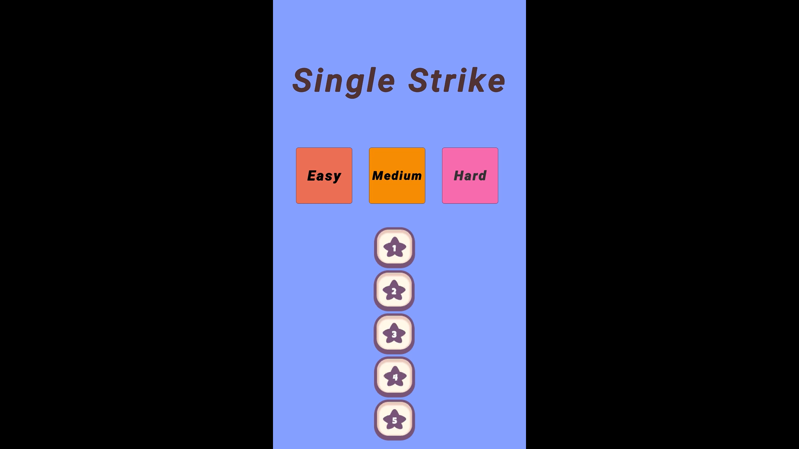
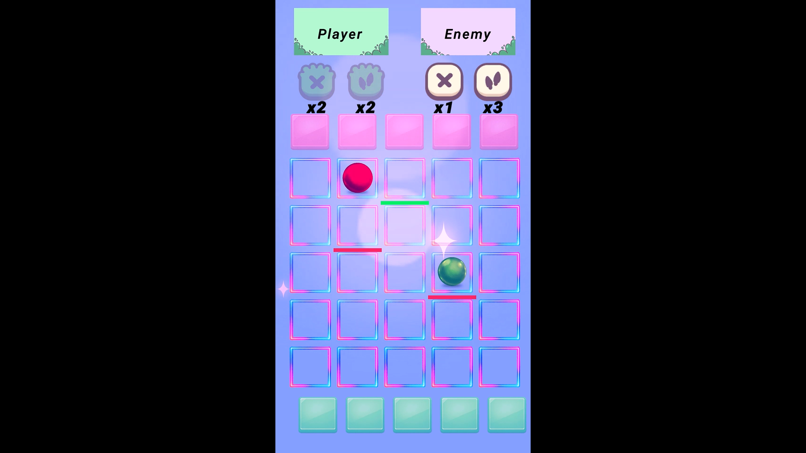
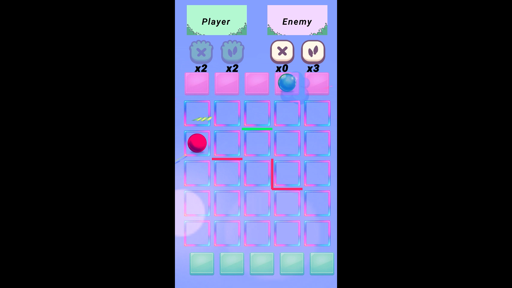
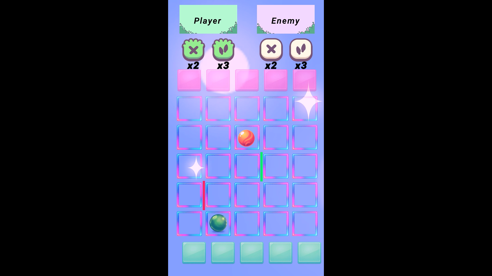
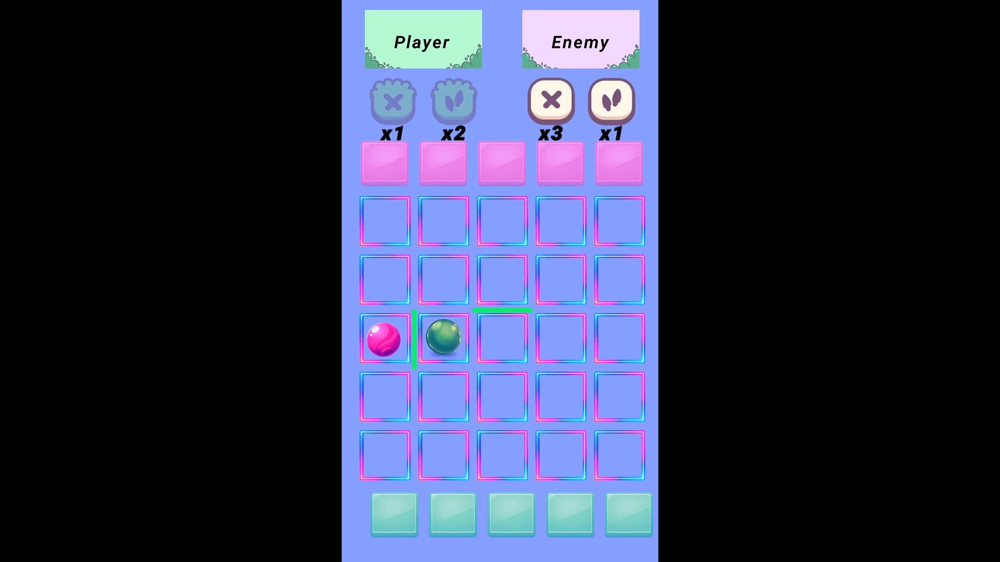
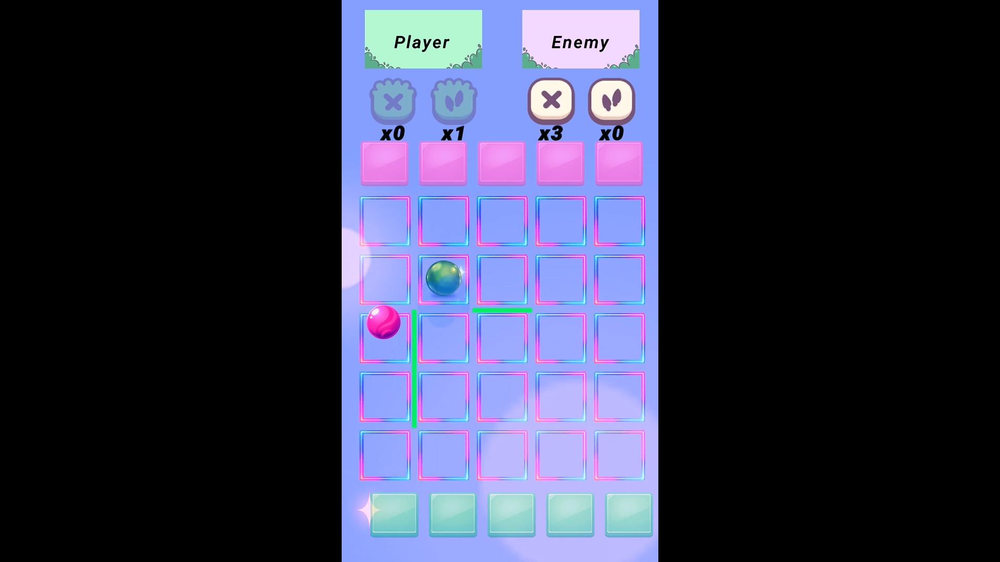

# ⚔️ Single Strike 2D

**Turn-based 2D strategy game** — Player vs AI. Place obstacles, push back your opponent, and reach the enemy zone to win!

---

## 🎯 Core Gameplay Loop

- Player and AI take turns on a 5x5 grid  
- Each turn, move 1 tile (up/down/left/right)  
- Reach the enemy's zone to win  
- Place obstacles to block your opponent  
- Use pushback to send the enemy back  
- 3 difficulty levels: Easy / Medium / Hard  

---

## 🧠 Core Systems Overview

### 🎮 Turn System (GameManager)

- Turn-based state machine (PlayerTurn → AITurn → Win/Lose)  
- Win/Lose detection on zone entry  
- Game over screen with sound and VFX  
- Scene reload after delay  

---

### 🧩 Grid System (GridManager)

- 5x5 tile-based grid  
- Edge-based obstacle placement  
- Blocked edge detection for movement  
- Tile occupancy tracking  

---

### 🤖 AI System (EasyAI / MediumAI / HardAI)

- **Easy AI:** 60% optimal, 25% random, 15% chaotic moves  
- Obstacle and pushback ability usage (30% chance)  
- Blocked tile detection and avoidance  
- Smooth movement with adjustable speed  

---

### 🧱 Obstacle System (AbilityManager)

- Place obstacles between two tiles  
- 3 obstacles and 3 pushbacks per player  
- Edge-based obstacle collision detection  
- Visual placement with rotation  

---

### 💥 Pushback System

- Player pushback → AI moves backward (up)  
- AI pushback → Player moves backward (down)  
- Win/Lose tile protection  
- Limited uses (3 per player)  

---

### 📊 Difficulty System

| Difficulty | AI Behavior | Description |
|------------|-------------|-------------|
| **Easy** | 60% optimal / 25% random / 15% chaotic | Beginner-friendly |
| **Medium** | 75% optimal / 20% random / 5% chaotic | Balanced challenge |
| **Hard** | 90% optimal / 10% random | Advanced strategy |

---

### ⚙️ Architecture

#### 🧩 Design Patterns

- Singleton (GameManager, GridManager)  
- State Machine (Turn Management)  
- Event-driven communication  
- Modular component-based design  

---

#### 🧠 Performance Strategy

- No unnecessary per-frame allocations  
- Coroutine-based animations  
- Object pooling for VFX  
- Lightweight GC-friendly design  

---

## 🛠️ Tech Stack

- Engine: Unity **6000.3.18f1*  
- Language: C#  
- Input: Unity New Input System  
- UI: Unity UI (uGUI) + TextMeshPro  
- Architecture: Modular + Component-based  
- Target Platform: Android / Mobile  

---

## 📸 Screenshots

  
  
  

  
  
  

---

## 🎬 Gameplay Preview

  

---

## 🚀 Status

- Core gameplay loop complete  
- Turn-based system implemented  
- Easy AI fully functional  
- Obstacle placement system complete  
- Pushback system integrated  
- 3 difficulty levels ready  
- VFX and audio feedback implemented  
- Mobile-optimized  
- Ready for Medium/Hard AI expansion  

---

## 📂 Main Scripts

- GameManager  
- GridManager  
- AbilityManager  
- PlayerMovement  
- EasyAI
- MediumAI
- HardAI  
- Tile  

---

**Made with ❤️ using Unity**
